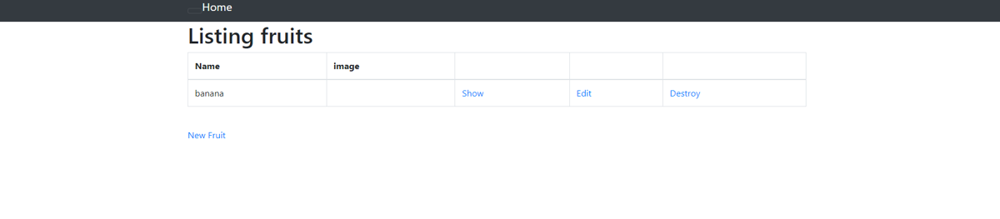

# AWSフルコース第３回課題
***

## 起動確認
サンプルアプリケーションを起動（デプロイ）し、ブラウザでアクセス確認。
New Fruitから入力を行い、反映確認。

## AP サーバーについて
- AP サーバーの名前：puma
- バージョン：puma version 5.6.5

AP サーバーを終了させた場合、Oops表示となり、アクセスできない。

## DB サーバーについて
- DB サーバーの名前：MySQL
- バージョン：my sql version 8.0.33

DB サーバーを終了させた場合、エラー表示となり、アクセスできない。

再起動を行うと、再度アクセス可能になる。

- 停止：sudo servise mysqld stop
- 再起動：sudo servise mysqld restart
- ステータス確認：sudo servise mysqld status

## Rails の構成管理ツール
- 名前：bundler
- バージョン：bundle version 2.3.14

## 学んだこと
### Rubyアプリケーションのデプロイの流れ
1. サンプルアプリケーションをcloneする。
1. Ruby、bundler、yarn or npmをインストール。必要に応じてバージョン更新する。
1. create、migrateでdbを構築。
1. bin/devでアプリケーション起動。

### 用語、コマンド

- bundler：gemをどのバージョンで使うか一元管理できる
- gem：ライブラリの集まり、積極的に外部ライブラリを使うと作業がはかどる。
- yarnとnpm
JavaScriptでサーバーサイドの処理を行うために使うプログラム
  - yarn：バージョン違いの依存プログラムのインストールは起こらない。インストール速度早い
  - npm：バージョン違いの依存プログラムをインストールする可能性あり。インストール速度遅い
- bundle exec：gemfileで指定された環境で実行する
- leesコマンド：テキストファイルを1画面ずつ表示する。 less[オプション]ファイル名
[q]を押すと終了。
- コピーの仕方
cp [オプション] コピー元　コピー先
- config：設定ファイル

### 感想
一つ一つのコマンドの意味を理解し知識を蓄積していきたい。
エラー表示が出たときに、和訳して、何が不明なのかは理解できるが、どこのフォルダ内のテキスト文を修正する必要があるのかが都度理解していかないといけないと感じた。
